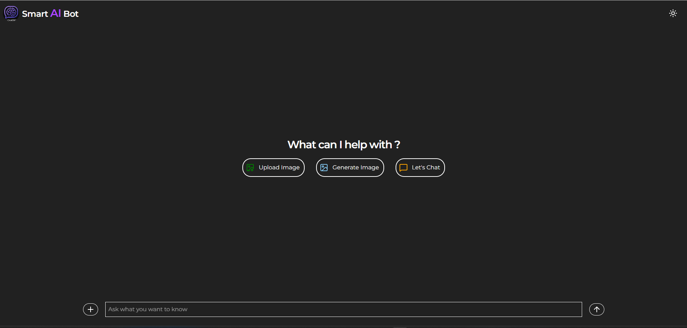

# 🤖 Smart AI Chat Bot

A modern **AI-powered chat bot** built with **React, TailwindCSS, Context API, Google Gemini API, and Hugging Face**.  
The bot can chat, answer queries, and generate images dynamically.  
It also supports **dark/light mode toggle** 🌗 and is deployed live on **Netlify**.

---

## 🚀 Live Demo
🔗 [Smart AI Chat Bot](https://gautam-ai-chat-bot.netlify.app/)

---

## ✨ Features
- 💬 **AI Chat** using Google Gemini API  
- 🖼️ **Image Generation** with Hugging Face models  
- 🎨 **Dark/Light Mode toggle**  
- 📱 **Responsive UI** built with TailwindCSS  
- ⚡ Fast and efficient using React + Context API  

---

## 🛠️ Tech Stack
- **Frontend:** React.js, Vite  
- **Styling:** TailwindCSS  
- **State Management:** React Context API  
- **AI APIs:** Google Gemini API, Hugging Face API  
- **Deployment:** Netlify  

---

## 📂 Project Structure
Smart-Ai-Chat-Bot/
│── public/ # static assets
│── src/
│ ├── components/ # React components (Chat, Home, Navbar, etc.)
│ ├── utils/ # Context API, helpers
│ ├── App.jsx
│ ├── main.jsx
│── screenshots/ # App screenshots
│ ├── light-mode.png
│ ├── dark-mode.png
│── .env # API Keys (not pushed to GitHub)
│── package.json
│── README.md

## 📸 Screenshots

### 🌞 Light Mode


### 🌙 Dark Mode

yaml
Copy code

---

## ⚙️ Installation & Setup

1. **Clone the repo**
```bash
git clone https://github.com/GAUTAMBISOI/Smart-Ai-Chat-Bot.git
cd Smart-Ai-Chat-Bot
Install dependencies

bash
Copy code
npm install
Add API Keys
Create a .env file in the root folder and add your keys:

env
Copy code
VITE_GEMINI_API_KEY=your_gemini_api_key
VITE_HF_API_KEY=your_huggingface_api_key
Run the project

bash
Copy code
npm run dev
📸 Screenshots
🌗 Dark Mode

☀️ Light Mode

🚀 Deployment
The project is deployed using Netlify.
To deploy your own:

bash
Copy code
npm run build
Then drag and drop the dist/ folder to Netlify.

🙌 Author
👨‍💻 Gautam Bisoi
🔗 GitHub

⭐ Contribute
If you like this project, give it a ⭐ on GitHub!


